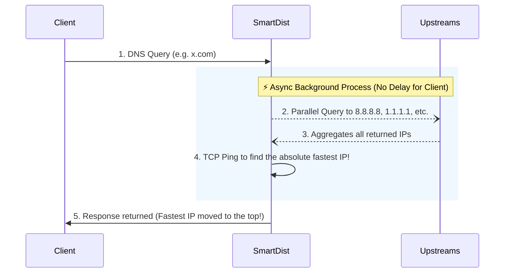

# SmartDist

**English** | [Bahasa Indonesia](README_id.md)

> **SmartDNS-style configuration for DnsDist** — Replicate SmartDNS features (IP aliasing, domain-set exclusions, wildcard CNAME, and **automatic speed-check for all domains**) in DnsDist 2.x with a pure Lua plugin.

## ✨ Features

- **SmartDNS-like syntax** — Familiar `ip-set`, `domain-set`, `cname`, and `ip-rules` functions
- **IP Alias (ip-rules)** — Rewrite DNS A/AAAA responses matching a CDN's IP range to your preferred edge IP
- **Multiple target IPs** — Round-robin support for multiple alias targets
- **IPv4 & IPv6** — Automatic detection and handling of both A and AAAA records
- **Domain exclusion** — Skip aliasing for specific domains via domain-set
- **Wildcard CNAME** — Spoof CNAME for wildcard domain patterns
- **🆕 Async Speed Check** — Automatically finds the fastest IP for **every domain** using background TCP probing (mimics SmartDNS `speed-check-mode ping,tcp:80,tcp:443`)
- **Graceful Degradation** — Speed Check silently disables itself if `lua-socket` is not installed; core features still work
- **Plugin architecture** — Clean separation between plugin logic and user configuration

## 📁 Project Structure

```
SmartDist/
├── dnsdist.conf            # Main config (user rules go here)
├── smartdns_plugin.lua     # Plugin: SmartDNS compatibility layer + Speed Check
├── docker-compose.yml      # Docker deployment
└── cdn-ips/                # IP & domain lists
    └── cloudflare/
        ├── ipv4.txt        # Cloudflare IPv4 ranges
        ├── ipv6.txt        # Cloudflare IPv6 ranges
        └── exclude.txt     # Domains to exclude from aliasing
```

## 🏗 Architecture & Topology (The SmartDNS Behavior)

SmartDist replicates the highly coveted **Parallel Upstream Aggregation & Fastest IP** mode directly inside DnsDist without external dependencies.



1. **Parallel Querying**: DnsDist sends background queries to ALL upstreams simultaneously. *(Note: Automatically uses the upstreams you define via `newServer()` in `dnsdist.conf`)*.
2. **Aggregation**: Gathers all IPs returned by all resolvers into one pool.
3. **Speedcheck**: Pings all IPs using non-blocking TCP Sockets (Port 80/443).
4. **Fastest-IP Reordering**: Edits the DNS response so the absolute fastest IP is placed at the very top of the list!


## 🚀 Quick Start

### Option A: Docker (Recommended)

```bash
git clone https://github.com/arcelo12/smartdist.git
cd smartdist
docker compose up -d
```

### Option B: LXC / VM / VPS (Bare-metal)

```bash
# Install dependencies
apt-get update && apt-get install -y dnsdist lua-socket

# Clone & place config
git clone https://github.com/arcelo12/smartdist.git /etc/smartdist
cp /etc/smartdist/dnsdist.conf /etc/dnsdist/dnsdist.conf
cp /etc/smartdist/smartdns_plugin.lua /etc/dnsdist/smartdns_plugin.lua

# Start service
systemctl enable --now dnsdist
```

> **Note:** `lua-socket` enables the **Speed Check** feature. Without it, all other features still work normally.

### Configure `dnsdist.conf`

```lua
-- Load plugin (FIRST)
dofile("/etc/dnsdist/smartdns_plugin.lua")

-- ... your ip-set, cname, ip-rules rules ...

smartdns_ip_set("cloudflare-ipv4", "/etc/smartdist/cdn-ips/cloudflare/ipv4.txt")
smartdns_domain_set("cf-exclude", "/etc/smartdist/cdn-ips/cloudflare/exclude.txt")
smartdns_cname("-.api.x.com", "api.x.com.cdn.cloudflare.net.")
smartdns_ip_rules_alias("cloudflare-ipv4", {"172.64.52.159", "172.64.87.224"}, "cf-exclude")

newServer("8.8.8.8")
newServer("1.1.1.1")

-- Speed Check parameters (set di sini, setelah semua rules)
SPEEDCHECK_MODE        = "fastest-ip" -- "fastest-ip" atau "fastest-response"
SPEEDCHECK_TIMEOUT_MS  = 200        -- Timeout TCP connect (ms)
SPEEDCHECK_PORTS       = {80, 443}  -- Port yang diuji
SPEEDCHECK_MAX_IPS     = 6          -- Maks IP yang dites per domain
SPEEDCHECK_MAX_RESPONSE= 2          -- Maks IP yang dikembalikan oleh fastest-response
SPEEDCHECK_CACHE_TTL   = 300        -- Detik cache hasil tercepat
SPEEDCHECK_QUEUE_LIMIT = 200        -- Maks antrian background

-- Aktifkan Speed Check (HARUS di bagian paling bawah)
smartdns_enable_speedcheck()
```

### Test

```bash
nslookup cloudflare.com <your-server-ip>
dig youtube.com @<your-server-ip>
```

## ⚡ Speed Check Feature

SmartDist replicates SmartDNS's `speed-check-mode ping,tcp:80,tcp:443` behavior:

| | SmartDNS | SmartDist |
|---|---|---|
| **Method** | Ping + TCP | TCP (port 80 & 443) |
| **Scope** | All domains | All domains |
| **Blocking?** | No (async) | No (async, via `maintenance()`) |
| **Cache TTL** | Dynamic | Configurable (`SPEEDCHECK_CACHE_TTL`) |
| **Dependency** | Built-in | `lua-socket` |

### How It Works

1. **First query** for `x.com` → DnsDist returns the initial response from the default upstream normally to prevent stalling. Background: Parallel UDP queries are sent to all `newServer` upstreams.
2. **Background worker** (`maintenance()`, runs every ~1s) aggregates all returned IPs and opens non-blocking TCP connections to all of them simultaneously.
3. **First connections** win → the fastest IP(s) are cached as winners for `SPEEDCHECK_CACHE_TTL` seconds.
4. **Next query** for `x.com` → DnsDist intercepts the response and rewrites it. In `fastest-ip` mode, it reorders the packet to put the absolute fastest IP at the top. In `fastest-response` mode, it overwrites the packet to return only the top N fastest IPs (based on `SPEEDCHECK_MAX_RESPONSE`).

## 🔌 Plugin API Reference

### `smartdns_ip_set(name, filepath)`

Load an IP range list into a named NetmaskGroup.

```lua
smartdns_ip_set("cloudflare-ipv4", "/etc/smartdist/cdn-ips/cloudflare/ipv4.txt")
```

**File format:** One CIDR per line (e.g. `173.245.48.0/20`). Lines starting with `#` are ignored.

### `smartdns_domain_set(name, filepath)`

Load a domain list into a named SuffixMatchNode.

```lua
smartdns_domain_set("cf-exclude", "/etc/smartdist/cdn-ips/cloudflare/exclude.txt")
```

**File format:** One domain per line. Wildcard prefix `*.` is auto-stripped.

### `smartdns_cname(pattern, target)`

Spoof CNAME for matching domains (supports SmartDNS `-.` and `.` wildcard prefixes).

```lua
smartdns_cname("-.api.x.com", "api.x.com.cdn.cloudflare.net.")
```

### `smartdns_ip_rules_alias(ip_set_name, target_ips, exclude_domain_set)`

Rewrite DNS responses: if any A/AAAA record matches the ip-set, replace all matching records with target IP(s).

```lua
-- Single target
smartdns_ip_rules_alias("cloudflare-ipv4", "172.64.87.224", "cf-exclude")

-- Multiple targets (round-robin)
smartdns_ip_rules_alias("cloudflare-ipv4", {"172.64.52.159", "172.64.87.224"}, "cf-exclude")
```

### `smartdns_enable_speedcheck()`

Activate the global asynchronous speed check hook for all domains. Call this **once**, at the **end** of your `dnsdist.conf` after all other rules.

```lua
smartdns_enable_speedcheck()
```

### Speed Check Globals (set in `dnsdist.conf` after rules, before `smartdns_enable_speedcheck()`)

| Variable | Default | Description |
|---|---|---|
| `SPEEDCHECK_ENABLED` | `true` | Master on/off switch |
| `SPEEDCHECK_MODE` | `"fastest-ip"` | `"fastest-ip"` (reorder) or `"fastest-response"` (top N IPs overwrite) |
| `SPEEDCHECK_TIMEOUT_MS` | `200` | TCP connect timeout (ms) |
| `SPEEDCHECK_PORTS` | `{80, 443}` | Ports to test |
| `SPEEDCHECK_MAX_IPS` | `6` | Max IPs tested per domain |
| `SPEEDCHECK_MAX_RESPONSE`| `2` | Max winning IPs to return (for fastest-response) |
| `SPEEDCHECK_CACHE_TTL` | `300` | Seconds to cache result |
| `SPEEDCHECK_QUEUE_LIMIT` | `200` | Max concurrent probe queue size |

## 📋 Requirements

| Component | Requirement |
|---|---|
| DnsDist | 2.x (tested on 2.0.5) |
| lua-socket | For Speed Check feature (optional) |
| Docker | For containerized deployment |

## 📜 License

MIT
