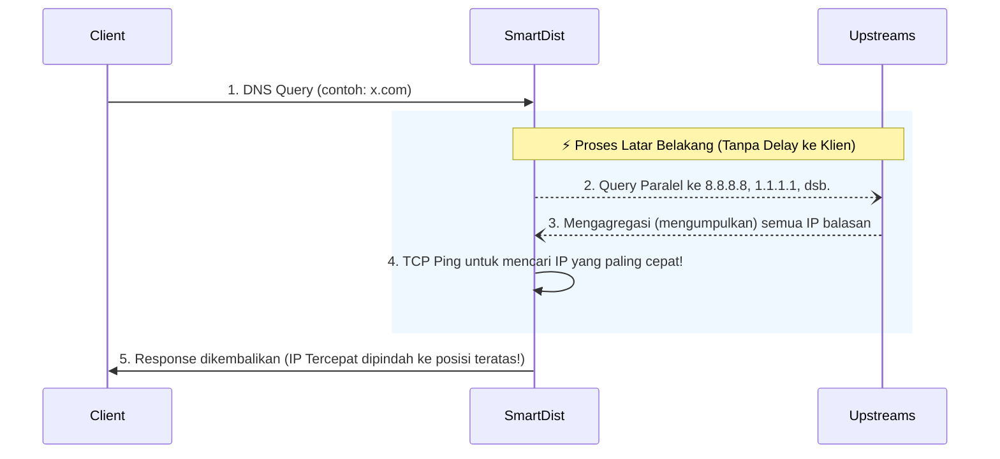

# SmartDist

[English](README.md) | **Bahasa Indonesia**

> **Konfigurasi bergaya SmartDNS untuk DnsDist** — Mereplikasi fitur-fitur SmartDNS (IP aliasing, pengecualian domain, wildcard CNAME, dan **pengecekan kecepatan otomatis untuk semua domain**) di dalam DnsDist 2.x menggunakan murni Lua plugin.

## ✨ Fitur

- **Sintaks ala SmartDNS** — Familiar dengan fungsi `ip-set`, `domain-set`, `cname`, dan `ip-rules`
- **IP Alias (ip-rules)** — Mengubah balasan DNS A/AAAA yang cocok dengan *range* IP CDN menuju IP edge pilihan Anda
- **Multiple Target IPs** — Mendukung *round-robin* untuk banyak IP target
- **IPv4 & IPv6** — Deteksi dan penanganan otomatis untuk record A maupun AAAA
- **Pengecualian Domain** — Melewati proses aliasing untuk domain tertentu menggunakan *domain-set*
- **Wildcard CNAME** — Manipulasi (spoof) CNAME untuk pola domain wildcard
- **🆕 Async Speed Check** — Secara otomatis mencari IP paling cepat untuk **setiap domain** menggunakan *background TCP probing* (meniru perilaku `speed-check-mode ping,tcp:80,tcp:443` di SmartDNS)
- **Graceful Degradation** — Speed Check akan mati secara diam-diam jika `lua-socket` tidak terpasang; fitur utama lainnya akan tetap berjalan
- **Arsitektur Plugin** — Pemisahan yang rapi antara logika plugin dengan konfigurasi pengguna

## 📁 Struktur Proyek

```
SmartDist/
├── dnsdist.conf            # Konfigurasi utama (tulis rule Anda di sini)
├── smartdns_plugin.lua     # Plugin: Lapisan kompatibilitas SmartDNS + Speed Check
├── docker-compose.yml      # Deployment Docker
└── cdn-ips/                # Daftar IP & domain
    └── cloudflare/
        ├── ipv4.txt        # Range IPv4 Cloudflare
        ├── ipv6.txt        # Range IPv6 Cloudflare
        └── exclude.txt     # Domain yang dikecualikan dari aliasing
```

## 🏗 Arsitektur & Topologi (Sifat Asli SmartDNS)

SmartDist mereplikasi mode canggih **Parallel Upstream Aggregation & Fastest IP** secara langsung di dalam DnsDist tanpa bantuan program luar.



1. **Query Paralel**: DnsDist mengirimkan query di latar belakang ke SEMUA upstream secara bersamaan. *(Catatan: Otomatis menggunakan server upstream yang Anda definisikan via `newServer()` di dalam `dnsdist.conf`)*.
2. **Agregasi**: Mengumpulkan semua IP yang dibalas oleh seluruh resolver menjadi satu wadah (*pool*).
3. **Speedcheck**: Melakukan Ping TCP secara *non-blocking* (Port 80/443) ke semua IP tersebut.
4. **Fastest-IP Reordering**: Mengedit respons DNS dengan menempatkan IP yang paling cepat secara absolut di posisi paling atas dari daftar!

## 🚀 Memulai Cepat (Quick Start)

### Opsi A: Docker (Direkomendasikan)

```bash
git clone https://github.com/arcelo12/smartdist.git
cd smartdist
docker compose up -d
```

### Opsi B: LXC / VM / VPS (Bare-metal)

```bash
# Instal dependensi
apt-get update && apt-get install -y dnsdist lua-socket

# Clone & letakkan konfigurasi
git clone https://github.com/arcelo12/smartdist.git /etc/smartdist
cp /etc/smartdist/dnsdist.conf /etc/dnsdist/dnsdist.conf
cp /etc/smartdist/smartdns_plugin.lua /etc/dnsdist/smartdns_plugin.lua

# Jalankan layanan
systemctl enable --now dnsdist
```

> **Catatan:** `lua-socket` dibutuhkan agar fitur **Speed Check** dapat menyala. Tanpa plugin ini, semua fitur lain akan tetap berfungsi normal.

### Konfigurasi `dnsdist.conf`

```lua
-- Muat plugin (PERINTAH PERTAMA)
dofile("/etc/dnsdist/smartdns_plugin.lua")

-- ... aturan ip-set, cname, ip-rules Anda di sini ...

smartdns_ip_set("cloudflare-ipv4", "/etc/smartdist/cdn-ips/cloudflare/ipv4.txt")
smartdns_domain_set("cf-exclude", "/etc/smartdist/cdn-ips/cloudflare/exclude.txt")
smartdns_cname("-.api.x.com", "api.x.com.cdn.cloudflare.net.")
smartdns_ip_rules_alias("cloudflare-ipv4", {"172.64.52.159", "172.64.87.224"}, "cf-exclude")

newServer("8.8.8.8")
newServer("1.1.1.1")

-- Parameter Speed Check (atur di sini, setelah semua rules)
SPEEDCHECK_MODE        = "fastest-ip" -- "fastest-ip" atau "fastest-response"
SPEEDCHECK_TIMEOUT_MS  = 200        -- Timeout TCP connect (ms)
SPEEDCHECK_PORTS       = {80, 443}  -- Port yang diuji
SPEEDCHECK_MAX_IPS     = 6          -- Maksimal IP yang dites per domain
SPEEDCHECK_MAX_RESPONSE= 2          -- Maksimal jumlah IP yang dikembalikan oleh fastest-response
SPEEDCHECK_CACHE_TTL   = 300        -- Berapa detik menyimpan IP tercepat di memori
SPEEDCHECK_QUEUE_LIMIT = 200        -- Maksimal antrian di latar belakang

-- Aktifkan Speed Check (HARUS diletakkan di bagian paling bawah)
smartdns_enable_speedcheck()
```

### Uji Coba

```bash
nslookup cloudflare.com <ip-server-anda>
dig youtube.com @<ip-server-anda>
```

## ⚡ Fitur Speed Check

SmartDist mereplikasi fungsionalitas `speed-check-mode ping,tcp:80,tcp:443` dari SmartDNS:

| | SmartDNS | SmartDist |
|---|---|---|
| **Metode** | Ping + TCP | TCP (port 80 & 443) |
| **Cakupan** | Semua domain | Semua domain |
| **Apakah Memblokir?** | Tidak (async) | Tidak (async, via fungsi `maintenance()`) |
| **Cache TTL** | Dinamis | Dapat diatur (`SPEEDCHECK_CACHE_TTL`) |
| **Dependensi** | Bawaan sistem | `lua-socket` |

### Cara Kerja Detail

1. **Query Pertama** untuk `x.com` → DnsDist mengembalikan respons awal dari upstream default agar koneksi tidak tertahan. Di *background*: UDP query paralel dikirimkan ke semua `newServer` Anda.
2. **Background Worker** (`maintenance()`, berjalan tiap ~1 detik) mengagregasi semua IP balasan dan membuka koneksi TCP *non-blocking* ke seluruh IP tersebut secara bersamaan.
3. **Respon Pertama** menang → Beberapa IP yang paling pertama merespons dicache sebagai "juara" selama `SPEEDCHECK_CACHE_TTL` detik.
4. **Query Berikutnya** untuk `x.com` → DnsDist mencegat respons dan mengubahnya. Pada mode `fastest-ip`, ia menukar urutan paket agar IP tercepat nomor #1 berada di urutan teratas. Pada mode `fastest-response`, ia akan menimpa balasan DNS agar hanya menampilkan beberapa IP terbaik (sesuai batasan `SPEEDCHECK_MAX_RESPONSE`).

## 🔌 Referensi API Plugin

### `smartdns_ip_set(name, filepath)`

Memuat daftar *range* IP ke dalam NetmaskGroup.

```lua
smartdns_ip_set("cloudflare-ipv4", "/etc/smartdist/cdn-ips/cloudflare/ipv4.txt")
```

**Format file:** Satu CIDR per baris (misal `173.245.48.0/20`). Baris yang diawali dengan `#` akan diabaikan.

### `smartdns_domain_set(name, filepath)`

Memuat daftar domain ke dalam SuffixMatchNode.

```lua
smartdns_domain_set("cf-exclude", "/etc/smartdist/cdn-ips/cloudflare/exclude.txt")
```

**Format file:** Satu domain per baris. Awalan wildcard `*.` otomatis dihapus.

### `smartdns_cname(pattern, target)`

Memanipulasi CNAME untuk domain yang cocok (mendukung awalan `-.` dan `.` seperti di SmartDNS).

```lua
smartdns_cname("-.api.x.com", "api.x.com.cdn.cloudflare.net.")
```

### `smartdns_ip_rules_alias(ip_set_name, target_ips, exclude_domain_set)`

Mengubah ulang (rewrite) respons DNS: jika ada record A/AAAA yang cocok dengan ip-set, gantikan IP tersebut dengan IP target pilihan Anda.

```lua
-- Target tunggal
smartdns_ip_rules_alias("cloudflare-ipv4", "172.64.87.224", "cf-exclude")

-- Target ganda (round-robin)
smartdns_ip_rules_alias("cloudflare-ipv4", {"172.64.52.159", "172.64.87.224"}, "cf-exclude")
```

### `smartdns_enable_speedcheck()`

Mengaktifkan fitur global *async speed check* untuk seluruh domain. Panggil fungsi ini **sekali saja**, di bagian **paling bawah** `dnsdist.conf` setelah Anda menetapkan semua aturan.

```lua
smartdns_enable_speedcheck()
```

### Variabel Global Speed Check

Dapat diatur di `dnsdist.conf` (sebelum memanggil `smartdns_enable_speedcheck()`).

| Variabel | Default | Deskripsi |
|---|---|---|
| `SPEEDCHECK_ENABLED` | `true` | Tombol utama nyala/mati |
| `SPEEDCHECK_MODE` | `"fastest-ip"` | `"fastest-ip"` (*reorder*) atau `"fastest-response"` (*overwrite top N IP*) |
| `SPEEDCHECK_TIMEOUT_MS` | `200` | Batas timeout TCP connect (milidetik) |
| `SPEEDCHECK_PORTS` | `{80, 443}` | Port TCP yang akan diping |
| `SPEEDCHECK_MAX_IPS` | `6` | Batas maksimal IP yang dites per domain |
| `SPEEDCHECK_MAX_RESPONSE`| `2` | Batas IP Juara yang dikembalikan oleh fastest-response |
| `SPEEDCHECK_CACHE_TTL` | `300` | Lama detik menyimpan hasil di memori |
| `SPEEDCHECK_QUEUE_LIMIT` | `200` | Kapasitas maksimal antrian *background probing* |

## 📋 Persyaratan Sistem

| Komponen | Syarat |
|---|---|
| DnsDist | 2.x (telah dites di versi 2.0.5) |
| lua-socket | Untuk menyalakan fitur Speed Check (opsional) |
| Docker | Untuk penyebaran (deployment) via container |

## 📜 Lisensi

MIT
